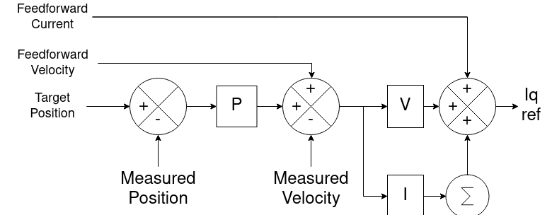

.. _Control theory:

******************
Control Principles
******************

This document provides a high-level introduction to the essential control principles in Tinymovr. Additional documentation regarding specific high-level control concepts is available in the :ref:`features` section.

Permanent Magnet Synchronous Motors (PMSMs)
###########################################

PMSMs is a category which includes the majority of hobby-grade brushless motors. PMSMs produce torque through the interaction of the magnetic field of the rotor permanent magnets with the magnetic field generated by the stator coils. The stator magnetic field "rotates" at a rate that is an integer multiple of the rotor rate of rotation, this is why this type of motor is termed "synchronous". 

This is also why, the motor controlled needs to be able to estimate the angular position of the rotor, in order to derive the stator magnetic field that produces torque. Many controllers estimate the rotor using magnetic encoder readings, which is then converted to electrical angle in software. This is termed *sensored estimation*, and this is the method employed in Tinymovr. In contrast, ESCs such as those used in drones use voltage feedback from one of the motor phases to estimate rotor position. This is termed *sensorless estimation*.

Field Oriented Control (FOC)
############################

Field Oriented Control (FOC) is a control scheme employed in brushless motor applications, offering superior performance compared to other algorithms. Although FOC requires more computational power due to its complexity, advancements in technology have made it increasingly accessible. Modern 32-bit microcontrollers can now execute FOC algorithms at high rates, contributing to its widespread adoption. By directly controlling the current in the motor phases, FOC enables precise torque management, resulting in enhanced performance and efficiency for various applications.

The FOC algorithm comprises three main elements:

1. Precise 3-phase current estimation
2. Transformation of 3-phase measurements to rotating frame.
3. Regulation of the rotational frame variables.

Measuring Phase Currents
************************

In order for FOC to work, the currents in the three phases (U, V, W) of the motor must be precisely estimated. This is done with the help of shunt resistors. Shunt resistors are high-power elements with low, precisely known resistance values, that are placed in series to the low-side mosfet sources, and enable current measurement by measuring the voltage differential across their terminals. Hardware and software filtering techniques improve current measurement accuracy.

As the motor phases are connected, current measurement in each of the three phases is redundant, and measurement in two phases would theoretically suffice. Nonetheless, having all three measurements allows for better accuracy through averaging of measurement errors. This is why Tinymovr uses three phase current measurement.

Reference Frames
****************

Next, the 3-phase measurements are transformed to the rotating frame of the rotor which is termed dq. The relevant transformation is known as the dq0 transform. The resulting quantities are the direct (d) current and quadrature (q) current. Motor torque is attributed to the quadrature component, while the direct component is minimized.

Current Regulation and Motor Parameter Identification
*****************************************************

Because the d and q quantities represent DC signals in the rotational frame, it is possible to apply PI regulation to control current.  For optimal regulation, the PI current regulation requires correct identification of proportional and integral gains. Tinymovr uses the method proposed in [1] to calculate the gains from the resistance and inductance motor parameters. The parameters are measured automatically by the firmware during the calibration procedure. 

Thus the whole process is automated, and you don't need to worry about it.

Control loop Overview
#####################

On top of the FOC loop, Tinymovr implements an embedded control loop. This control loop runs at a 20kHz rate.

Position mode
*************

This is the most versatile mode, it accepts a position setpoint, and additional velocity and current feedforward terms.

You can tune separately each gain of the loop.

**P_p**: The gain of the position proportional term

**P_v**: The gain of the velocity proportional term

**I_v**: The gain of the velocity integral term

The integral term is especially useful for tracking positions at low velocities. You can set it to zero for greater position control bandwith.

Velocity Integrator Deadband
----------------------------

The integrator deadband is a setting that is useful in minimizing the "hunting" phenomenon, where the rotor oscillates around the setpoint at standstill. This phenomenon is due to interaction of integrator windup and the non-linearities of cogging torque. The integrator deadband feature is only active in position control mode and disables the integrator term update within a configurable window around the position setpoint (the "deadband").

Take a look at the :ref:`integrator-deadband` endpoint for specifics.

Example applications
--------------------

Robot joint control, CNC axis.

Velocity mode
*************

In this mode the controller accepts a velocity setpoint, and an optional current feedforward term.

Example applications
--------------------

Drone and aircraft propeller
    Large airframes where constant angular velocity is desired, without exceptionally high RPM (i.e. 5000rpm or less).
Industrial Automation
    Where constant RPM is required, regardless of load. Pumps, ventilators, cutters, drills, etc.
Wheel propulsion
    For brushless wheel based projects like differential drives or rovers.

Current mode
*************

This is the most direct mode, where you can specify current setpoints, that are direct inputs to the FOC algorithm.

Example applications
--------------------

Force based control
    Robots controlled in admittance or impedance.
E-scooter
    Where the throttle input is mapped to the current target. It translates to the acceleration of the vehicle, which feels more natural than a velocity input.

Further Reading
###############

Additional documentation regarding specific high-level control concepts in Tinymovr is available in the :ref:`features` section.

`Vector Control (Wikipedia) <https://en.wikipedia.org/wiki/Vector_control_(motor)>`_

`Sensorless Field Oriented Control of Brushless PMSMs <https://krex.k-state.edu/dspace/bitstream/handle/2097/1507/JamesMevey2009.pdf;jsessionid=820C6C90C0851225CAE19AF829939F2A?sequence=1>`_

References
##########

[1] `High Performance Brushless DC Motor Control <https://www.ti.com/cn/lit/an/sprt702/sprt702.pdf?ts=1618338543430&ref_url=https%253A%252F%252Fwww.google.com%252F>`_