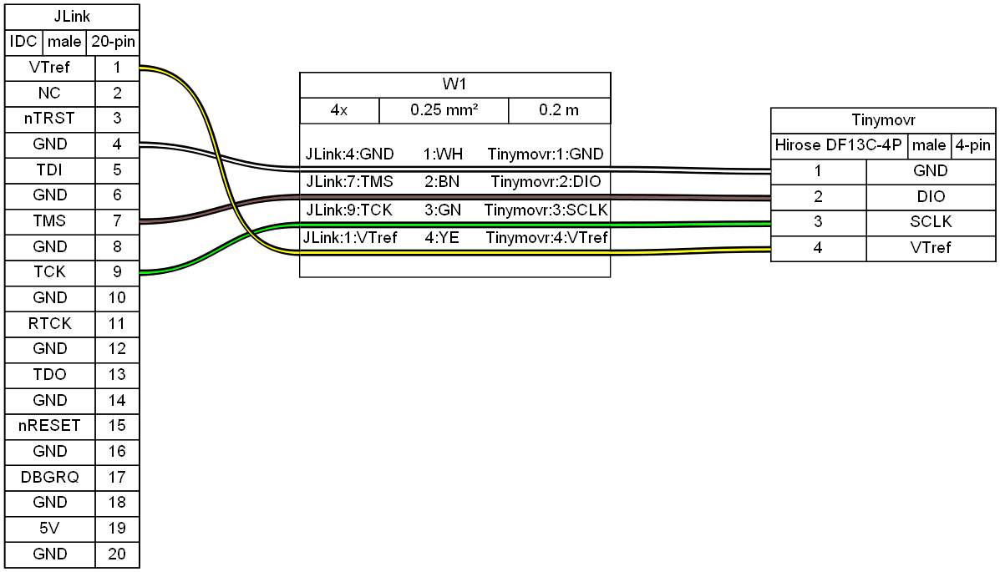
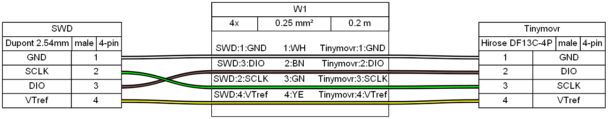

********************
Firmware Development
********************

Overview
########

This document provides a guide for setting up a development environment for developing Tinymovr firmware. There are two alternatives, a cross-platform approach using the Arm toolchain, make and VSCode, and a Windows-only approach using Eclipse. The former is suggested.

Hardware Connections
####################

For proper debugging capabilities you will need a Segger J-Link adapter. Unfortunately original J-Link adapters are quite expensive. A more affordable option is the J-Link EDU adapter at around $60 or the J-Link EDU mini adapter at around $20. In addition, there are J-Link clones that can be purchased for very low prices on ebay or Aliexpress. However, reliability of these clones is not guaranteed.

With the board and J-Link adapter powered off, connect the J-Link to Tinymovr as shown below:

Connection directly to J-Link adapter:

Connection with SWD adapter (e.g. isolator):

(diagrams made with `Wireviz <https://github.com/formatc1702/WireViz>`_)

Setting up the repo
###################

First, clone the Tinymovr repo:

.. code-block:: console

    git clone https://github.com/yconst/Tinymovr

The Tinymovr repo includes the firmware source code and supporting files, however the PAC55xx SDK is not included due to licensing restrictions imposed by Qorvo. Thus, you will need to `download it from the Qorvo website <https://www.qorvo.com/products/p/PAC5527#evaluation-tools>`_, where you will need to supply your email.

The file comes in a zipped installer exe (!), which all it does is extract the contents to a directory. Navigate to the extracted files directory and copy the 'pac55xx_sdk' directory inside the Tinymovr repo:

.. code-block:: console

    cp -r <pac55xx_sdk_location> <tinymovr_location>/firmware/

Now you have the required PAC SDK almost ready. As a final step, there is a small patch that you will need to apply in the pac55xx_sdk directory. It is suggested to use the `Python patch package <https://pypi.org/project/patch/>`_, which is cross-platform. If you do not have the package, install using pip:

.. code-block:: console

    pip3 install patch

Then:

.. code-block:: console

    cd <tinymovr_location>/firmware
    python3 -m patch sdk_patch.patch

Done.

.. _setting-up-vscode:

Using VSCode
############

VSCode-based Tinymovr development is a cross-platform solution (Linux, Macos and Windows supported) for building, flashing and debugging firmware. As of November 2021, it is the official approach to Tinymovr development.

The Tinymovr repo includes all VSCode settings configured. You will need to install the `GNU Arm Embedded Toolchain <https://developer.arm.com/tools-and-software/open-source-software/developer-tools/gnu-toolchain/gnu-rm/downloads>`_, and J-Link drivers. 

The required J-Link drivers and software, together with instructions, can be found in the `Qorvo website <https://www.qorvo.com/products/p/PAC5527#evaluation-tools>`_, under the download 'Segger J-Link Support'. This download includes a nacessary patch to enable J-Link to work with Qorvo devices. Instructions on how to apply the patch are included.

In addition, if you are in Windows you will need to install GNU make. This is rather easy in Windows 10 or later:

.. code-block:: console

    choco install make

Once you have the J-Link adapter wired up and the software installed, you are ready to flash and debug the firmware. To try out a test build from within VSCode select Terminal -> Run Task... from the menu bar. Then select Clean and Build Project (Debug). You should end up with a ``build/`` directory inside ``firmware/`` and there you should see the files ``tinymovr_fw.elf`` and ``tinymovr_fw.hex``.

To flash the firmware, provided your J-Link adapter is connected and drivers properly installed, hit F5. After a while you should see a screen like below:

(image)

Congrats! You are now fully set to develop!

.. _setting-up-eclipse:

Using Eclipse
##################

Eclipse is the legacy method of developing Tinymovr firmware and is no longer actively supported. Consider switching to VSCode-based development instead.

You will need the Qorvo-supplied Eclipse distribution, which is Windows-compatible. Download from the `Qorvo website <https://www.qorvo.com/products/p/PAC5527#evaluation-tools>`_.

Run the downloaded installer that will install Eclipse and the J-Link utility (ver. 6.31) for you.

Once installation is complete, run Eclipse and import the Tinymovr project. Try building to verify everything is ok. You are now ready to flash and debug using Eclipse.

