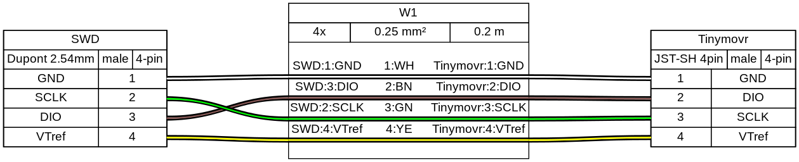

**********
Developers
**********

Overview
########

This document provides a guide for setting up a development environment for developing for Tinymovr, including firmware and client software (Studio). 

Hardware Connections
####################

For proper debugging capabilities you will need a Segger J-Link adapter. Unfortunately original J-Link adapters are quite expensive. A more affordable option is the J-Link EDU adapter at around $60 or the J-Link EDU mini adapter at around $20. In addition, there are J-Link clones that can be purchased for very low prices on ebay or Aliexpress. However, reliability of these clones is not guaranteed.

With the board and J-Link adapter powered off, connect the J-Link to Tinymovr as shown below:

Connection directly to J-Link adapter for R3.x:

.. image:: jtag_r3x.png
  :width: 800
  :alt: Tinymovr R3.x pin header connection

Connection directly to J-Link adapter for R5:

Connection with SWD adapter (e.g. isolator) for R3.x:

Connection with SWD adapter (e.g. isolator) for R5:

(diagrams made with `Wireviz <https://github.com/formatc1702/WireViz>`_)

As of Tinymovr 1.0.1, it is no longer necessary to patch the `JLinkDevices.xml` file with the PAC additions, in order for JLinkGDBServer to work properly. Relevant files are included in the repo.

.. _develop-preparation:

Preparation
###########

First, clone the Tinymovr repo:

.. code-block:: console

    git clone https://github.com/yconst/Tinymovr

The Tinymovr repo includes the firmware source code and supporting files, however the PAC55xx SDK is not included due to licensing restrictions imposed by Qorvo. Thus, you will need to `download it from the Qorvo website <https://www.qorvo.com/products/p/PAC5527#evaluation-tools>`_, where you will need to supply your email.

The file comes in a zipped installer exe (!), which all it does is extract the contents to a directory. Navigate to the extracted files directory and copy the 'pac55xx_sdk' directory inside the Tinymovr repo:

.. code-block:: console

    cp -r <pac55xx_sdk_location> <tinymovr_location>/firmware/pac55xx_sdk/

In any case, the target directory should be named `pac55xx_sdk`. The above copy command ensures this.

Now you have the required PAC SDK almost ready. There is a small patch that you will need to apply in the pac55xx_sdk directory. It is suggested to use the `Python patch package <https://pypi.org/project/patch/>`_, which is cross-platform. If you do not have the package, install using pip:

.. code-block:: console

    pip3 install patch

Then:

.. code-block:: console

    cd <tinymovr_location>/firmware
    python3 -m patch sdk_patch.patch

As a final step, install the `GNU Arm Embedded Toolchain <https://developer.arm.com/tools-and-software/open-source-software/developer-tools/gnu-toolchain/gnu-rm/downloads>`_. 

If you are in Windows you will also need to install GNU make. This is rather easy in Windows 10 or later:

.. code-block:: console

    choco install make

.. _develop-setting-up-vscode:

Using VSCode
############

Our development environment for Tinymovr utilizes VSCode and is designed with cross-platform compatibility in mind. We support all major operating systems: Linux, MacOS, and Windows. This method allows for a unified approach to building, flashing, and debugging firmware.

We take great pride in creating this in-house, cross-platform development solution, as an alternative to the official Windows-only solution, providing enhanced flexibility and simplifiyng the process of developing for Tinymovr across multiple platforms.

Configuring
***********

You'll need to configure the path to the JLink debug server in `.vscode/launch.json`. The configuration blocks look like this:

.. code-block:: javascript
  
    "windows": {
        // Update the path below as necessary
        "serverpath": "C:\\Program Files\\SEGGER\\JLink\\JLinkGDBServerCL.exe" 
    },
    "linux": {
        // Update the path below as necessary
        "serverpath": "/opt/SEGGER/JLink/JLinkGDBServer" 
    }

There are several instances of such blocks in the file that need to be updated.

Building
********

To try out a test build from within VSCode select ``Terminal -> Run Task...`` from the menu bar, and select ``Clean and Build Project (Debug)``.

.. image:: tasks_list.png
  :width: 800
  :alt: Task selector

Tinymovr implements board revision selection using an input menu with a few predefined choices.

.. image:: revision_list.png
  :width: 800
  :alt: Board revision selector

Select the board revision against which you are compiling from the list. The build process will start, it usually takes less than half a minute. After it finishes, you should end up with a ``build/`` directory inside ``firmware/`` and there you should see the files ``tinymovr_fw.elf``, ``tinymovr_fw.hex`` and ``tinymovr_fw.bin``.

More about Hardware Revisions
-----------------------------

Tinymovr passes the `BOARD_REV_XX` argument regarding the board revision to the compiler. This is used in the firmware to configure the hardware accordingly. Invoking a make command with the REV argument is as follows:

.. code-block:: console

    make debug REV=R5

Currently the following hardware revision values are supported:

- R32
- R33
- R50
- R51
- R52
- M5

Flashing and Debugging
**********************

Before debugging, make sure the J-Link drivers and software is installed. The drivers and software, together with instructions, can be found in the `Qorvo website <https://www.qorvo.com/products/p/PAC5527#evaluation-tools>`_, under the download 'Segger J-Link Support'. This download includes a nacessary patch to enable J-Link to work with Qorvo devices. Instructions on how to apply the patch are included in the download.

The Tinymovr repo includes all VSCode settings configured, except for the JLink `serverpath` variable in `launch.json`, which you'll need to update to reflect your system. Note that there are multiple instances in the file, you'll need to update all of them.

We offer various VSCode launch configurations to suit different development and debugging tasks, including remote Tinymovr flashing debugging using a remote JLink server. These are are briefly outlined below.

Rebuild Debug and Start Session
-------------------------------

This is a convenience configuration that does a clean debug build, flashes it and launches a debug session. After a while the debug session should start and you should see a screen like below:

.. image:: Capture.PNG
  :width: 800
  :alt: Tinymovr firmware debug session using VSCode

Rebuild Release and Flash
-------------------------

This is a convenience configuration that does a clean release build and flashes it to Tinymovr.

Flash Built Binary and Start Session
------------------------------------

This will flash an already built binary and start a debug session. It assumes a binary already exists in the ``firmware/build/`` directory.

Flash Built Binary
------------------

This will flash an already built binary. It assumes a binary already exists in the ``firmware/build/`` directory.

Attach to Target
------------------

This will attach to an already running target.

Flash Built Binary and Start Remote Session
-------------------------------------------

This will connect to a remote JLink server, upload the firmware to the remote Tinymovr device, and start a remote debug session. You will need to have a JLink Server configured on a network attached device, such as a Raspberry Pi (`here is a good guide on how to do that <https://blog.feabhas.com/2019/07/using-a-raspberry-pi-as-a-remote-headless-j-link-server/>`_). You will also need to input the remote device's IP address to the ``ipAddress`` field of the ``launch.json`` file.

Note that the launch configurations can be selected and initiated from the VSCode "Run and Debug" pane. You can also hit ``F5`` to launch the currently selected configuration.

Congrats! You are now fully set to start with Tinymovr development!

Using Eclipse
#############

Eclipse is no longer supported. Consider :ref:`develop-setting-up-vscode` instead.

Setup Studio for Development
############################

Tinymovr Studio is a Python application and as such can be easily set up to facilitate development. The approach is to use `pip` to install Tinymovr in develop mode, from a local copy of the (`git repo <https://github.com/tinymovr/Tinymovr>`_). This allows any changes you make to the local code to be immediately available when you run the executable (`tinymovr`, `tinymovr_cli`, or `tinymovr_dfu`).

.. note::
   We recommend installing Tinymovr in a virtual environment. `Here is a quick tutorial on how to setup a virtual environment using Conda <https://conda.io/projects/conda/en/latest/user-guide/getting-started.html#managing-environments>`_.

Clone the Tinymovr repo as outlined in the first step of :ref:`develop-preparation`. Then:

.. code-block:: console

    cd <tinymovr_location>/studio/Python/
    pip3 install -e .

or to enable GUI support:

.. code-block:: console

    pip3 install -e .[GUI]

This will install the Tinymovr Studio in develop mode. Now, `tinymovr`, `tinymovr_cli` and `tinymovr_dfu` will use the local Tinymovr Studio code.

Happy coding!

