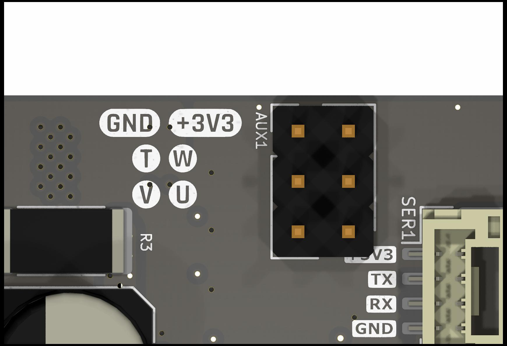

Encoders
########

Overview
********

This document provides information and guides for using the various encoder types supported by Tinymovr.

Observer bandwidth
******************

Tinymovr uses an observer in order to filter readings from the encoders. The bandwidth value corresponds to the desired observer bandwidth. It is a configurable value and depends on the dynamics that you wish to achieve with your motor. Keep in mind that high bandwidth values used with motors with fewer pole pairs will make the motors oscillate around the setpoint and have a rough tracking performance (perceivable "knocks" when the rotor moves). On the other hand, too low of a bandwidth value may cause the motor to lose tracking in highly dynamic motions. If you are certain such motions will not be possible (e.g. in heavy moving platforms) you may reduce the bandwidth to ensure smoother motion.

Onboard Magnetic
****************

All Tinymovr controllers feature an onboard magnetic absolute angle sensor that allows high precision angle measurement for efficient commutation and high bandwidth motor control. This is enabled by default and does not require any specific setup, apart from initial encoder/motor calibration.

The onboard sensor is enabled by default, so no special configuration is necessary. Should you need to switch to the onboard sensor, use the following commands:

.. code-block:: python

    tm1.set_encoder_config(0, 1500) # encoder type, bandwidth
    tm1.save_config()
    tm1.reset() # encoder change is applied after reset

The value of 1500 in bandwidth is the default value configured for the onboard sensor, which works well for most configurations.

Hall Effect Sensor
******************

Tinymovr R5 supports external Hall effect sensors for commutation and positioning. Hall effect sensors generate a specific sequence in the 3 phase encoder signal as the rotor moves. By reading this sequence, the rotor position is determined in one of six 60 degree sectors along the electrical cycle. 

Hardware Setup
--------------

To use Hall effect sensors, you need to connect the sensor's power supply, phases and ground to the correct pins on the Tinymovr board. The pinout for the Hall effect sensor connector is shown below.

.. note::
  The diagram shows the connector side of the board, i.e. the side where the CAN, UART and SPI connectors, and also the DC-link capacitors are located.

Note the U, V and W pins. These need to be connected to the respective pins of the sensor. The pin labeled T is currently not in use. In addition, the 3.3V power supply and the GND need to be connected to the sensor as well.

.. note::
  Tinymovr supplies 3.3V on the AUX power supply pin. If your sensor uses 5V, or if it needs more than 50mA, you'll need to provide power externally, e.g. through a dedicated buck converter. 

Configuration
-------------

As a first step you need to configure the sensor type and observer bandwidth.

.. code-block:: python

    tm1.set_encoder_config(1, 100) # encoder type, bandwidth

This sets the encoder type to Hall effect sensor, and the encoder bandwidth to 100. 

Next, you need to set the motor configuration:

.. code-block:: python

    tm1.set_motor_config(0, 15, 4) # motor type, pole pairs, calibration current
    tm1.save_config()
    tm1.reset() # encoder change is applied after reset
    
This sets the motor type and pole pairs, and restarts Tinymovr. The board needs to be reset following saving of the config, to enable the encoder change. For safety reasons, any change to the encoder type is only enabled at next boot. 

Next comes tuning of gains. Gains are determined on the resolution of a full mechanical turn fo the motor. When using the onboard magnetic sensor, the resolution is fixed to 8192 ticks. However, when using the Hall effect sensor, the mechanical resolution is variable, and amounts to `6 * pole_pair_count`. As such, if you have a 15 pp motor, your mechanical resolution would be 90. 

Because of this vast change in resolution (almost 2 orders of magnitude), the gains need to be updated:

.. code-block:: python

    tm1.set_gains(5, 0.07) # position gain, velocity gain

The values above are just an example using a 15 pp hoverboard motor. For your own motor, you need to determine these experimentally. In position control mode, start by raising the default velocity gain until your motor experiences oscillations. The back up by a factor of two, and repeat the same for velocity control. This simple tuning heuristic does not result in an optimal configuration but the gains are workable.

Last step is motor/encoder calibration:

.. code-block:: python

    tm1.calibrate()

After calibration finishes, you should be able to control the motor:

.. code-block:: python

    tm1.velocity_control()
    tm1.set_vel_setpoint(100) # around 60 rpm for a 15 pp motor

The motor should now move at a constant velocity.