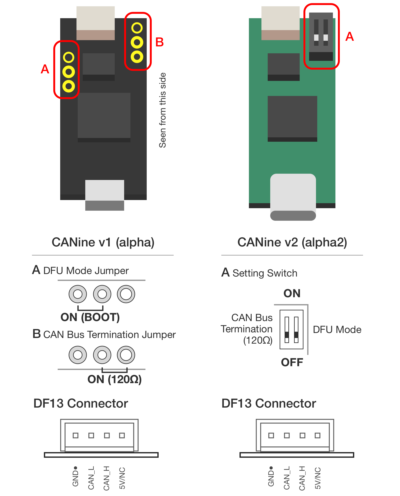

**********************
CANine adapter
**********************

Introduction
############

CANine is a USB Type-C <-> CAN Bus adapter. Itself it is an adaptation of the CANable board. It features DF-13 connectors in addition to 2.54mm header, as well as a convenient DIP switch for setting CAN termination resistor and boot mode.

This design is Open Source, released under the original CANable license.

Hardware
########

* STM32F042C6 MCU
* MCP2551 CAN Bus Transceiver
* Dual DF13/2.54mm Pin header CAN interface
* USB Type-C (v2) / micro (v1) interface

Hardware Configuration
######################

