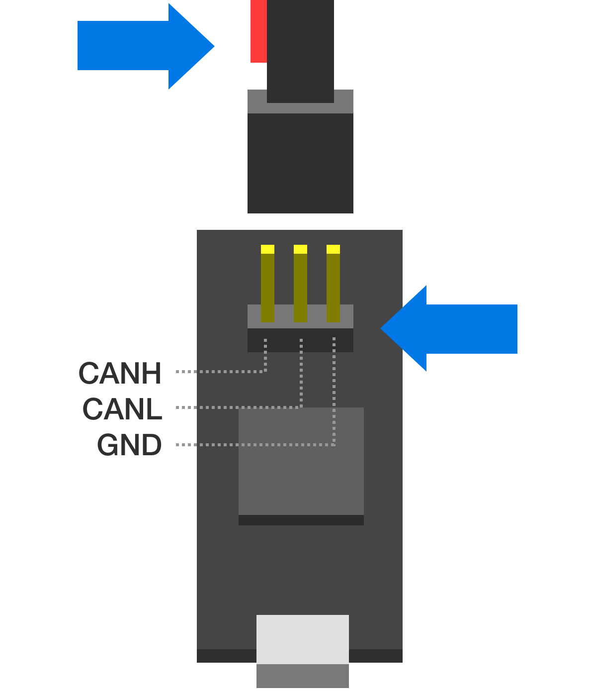

Hardware Errata
###############

.. _alpha-erratum-1:

Tinymovr Alpha CAN Bus Connector Erratum
****************************************

The CANine v1 Adapter that came with Tinymovr alpha had the DF-13 pins reversed and as such is not compatible with regular DF-13 cables. Alpha users are advised to use the alternative pin header on the board and the included DF-13 to 2.54mm pin converter cable to communicate with Tinymovr, as shown in the diagram below:

Note above that the red wire should stay disconnected and to the left side of the board as viewed from the USB port side.

.. _alpha-erratum-2:

Tinymovr Alpha USB Micro Connector Erratum
******************************************

The USB Micro connector used in the v1 adapter was unfortunately not very robust. In order to ensure that there is a good contact between the board and the USB cable, please ensure the male connector of the cable is firmly seated in the female connector of the board.

In addition, avoid exerting lateral forces to the connector (upwards or downwards) as they place stress on the soldered retaining flaps.

Later adapter revisions (aka CANine) use a USB Type C connector and do not have this issue.

.. _r51-erratum-1:

Tinymovr R5 UART Silkscreen Reversed
************************************

The silkscreen next to the UART port on the rear of Tinymovr R5 has the order of pins reversed. The correct pins are provided in the figure below.

