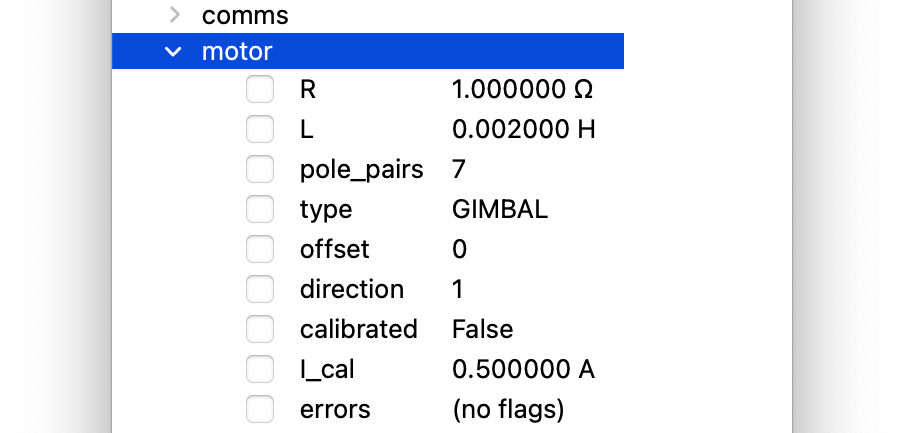
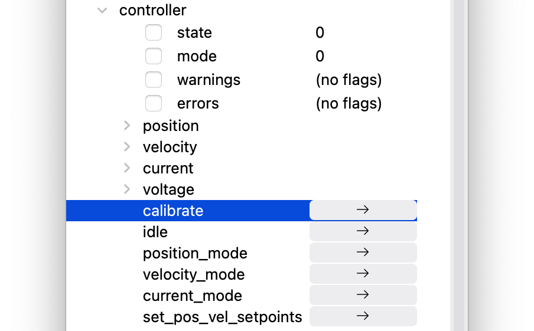

.. _gimbal-motors:

*************
Gimbal Motors
*************

.. |cli| raw:: html

   CLI

.. |gui| raw:: html

   GUI

.. _gimbal-introduction:

Introduction
------------

Tinymovr can drive gimbal-style brushless motors in open loop current control, by disabling current sensing. 

.. warning::
   * This mode is not recommended for Tinymovr M5, which is a specialized gimbal driver and can do closed loop current control with gimbal motors.

What is a gimbal motor anyway?

A gimbal motor is a 3-phase brushless motor whose stator is wound with many turns, and as such exhibits much larger resistance and inductance compared to the high-current brushless motors used to provide lift to drones, rc planes etc. Gimbal motors are used in... well... camera gimbals mainly. Similar motors can be found in light robotic joints. Such motors offer smooth motion and require small currents to produce torque compared to the 'high current' brushless motors. This in turn can help minimize the size of the motor driver and associated wires etc. Note that we refer to reduction of current through the stator windings and not the power converted to heat as a result of Joule heating of stator windings, which is still the same for the same amount of torque.

To achieve closed-loop current control, motor controllers such as Tinymovr use current measurement resistors in each phase (usually in series with the low-side mosfet) to estimate the current in the motor windings. These resistors have low resistance (in the range of a few milliOhms at most), to limit power dissipation in the resistor and allow operation in wide current ranges (up to several tens of Amps, even hundreds). The drawback is that current measurements exhibit noise of 100s of mA, and as such do not offer accurate measurements of small currents.

The gimbal mode of Tinymovr disables closed-loop current control. The commanded currents are converted to voltages using basic resistance and inductance formulas. 

.. _enabling-gimbal-mode:

Enabling Gimbal Mode
--------------------

.. warning::
   * DO NOT perform calibration on a gimbal motor without setting gimbal mode first! There is a risk of damaging the motor and board.
   
   * Using arbitrary resistance and inductance settings can damage your motor and board.

To enable gimbal mode, set the motor configuration as follows:

|gui|

|cli|

.. code-block:: python

    >>>tm1.motor.type = 1 # gimbal type
    >>>tm1.motor.R = {motor_resistance}
    >>>tm1.motor.L = {motor_inductance}
    >>>tm1.motor.I_cal = {calibration_current}

Example

.. code-block:: python

    >>>tm1.motor.type = 1
    >>>tm1.motor.R = 5
    >>>tm1.motor.L = 2e-3
    >>>tm1.motor.I_cal = 0.5

     >>>tm1.set_motor_RL(5, 0.002)

This specifies a motor with 5 Ohms resistance, 2 Millihenries inductance and 0.5Amps calibration current.
Alternatuvely, using the units interface:

.. code-block:: python

    >>>tm1.motor.type = 1 # gimbal type
    >>>tm1.motor.R = 5 * Ohm
    >>>tm1.motor.L = 2e-3 * Henry
    >>>tm1.motor.I_cal = 0.5 * Amps

Control that the settings are correct:

|cli|

.. code-block:: python
    
    >>>tm1.motor

Ensure the values above are correct. You can now calibrate the motor:

|gui| Set Gimbal Motor Parameters

|cli|

.. code-block:: python
    
    >>>tm1.controller.calibrate()

Because the motor is set as gimbal, calibration will bypass resistance and inductance measurement, and will only calculate pole pairs, offset and direction. After calibration `tm1.motor.calibrated` should have a value of True:

|gui| Calibrate Motor

|cli|

.. code-block:: python
    
    >>>tm1.motor.calibrated
    True

Controlling the Motor
---------------------

Gimbal mode has identical functionality as the default high-current mode. Position, velocity and current control modes are supported. Depending on your motor charaacteristics, you may have to tune the control gains to achieve optimal performance. In addition, due to the fact that current control is open loop, high angular velocities may not be available.
