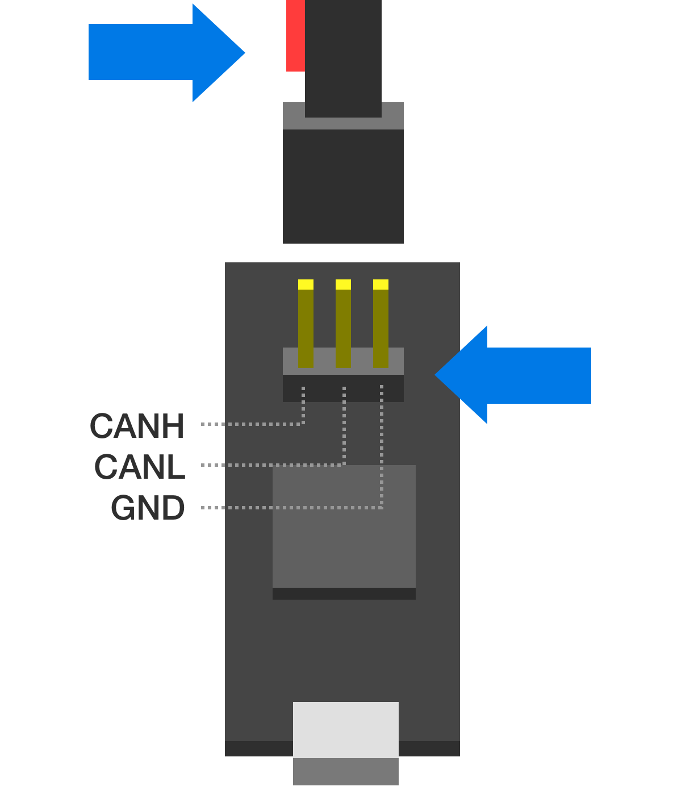

.. _hardware-setup-guide:

********************
Hardware Setup Guide
********************

.. note::
   Images in the documentation may refer to slightly different hardware versions. Where incompatibilities among hardware versions do exist, this is noted in the image caption.

Requirements
############

1. A 3-phase brushless motor (see below for supported types)
2. A means to talk CAN Bus, such as CANine or a Canable-compatible adapter.
3. A mechanical rig that ensures firm connection between the Tinymovr PCB and the brushless motor. Designs that can be 3D printed are available.

Note that the Tinymovr Dev Kit includes all of the above in a ready to use kit.

Supported Motor Types
#####################

Most three-phase pancake-style outrunners can be used with Tinymovr. While there is a lot of variation between motors of even the same size and external appearance, as a general rule-of-thumb motors ranging from 40mm outer diameter to 110mm should work fine with Tinymovr.

(image)

Mechanical Setup
################

Board dimensions
****************

.. image:: dimensions.png
  :width: 800
  :alt: Tinymovr dimensions

Mounting motor and Tinymovr
***************************

The most important aspect of a correct setup is to ensure the controller is properly positioned in relation to the motor. The center of the PCB, where the encoder is located, should lie as close to the motor rotation axis as possible. In addition, the distance from the encoder magnet to the encoder IC should be less than 2mm (less than 1mm if you are mounting the PCB packwards, i.e. the encoder IC is facing away from the magnet).

.. figure:: mount.png
  :width: 800
  :align: center
  :alt: Tinymovr and motor mechanical mounting
  :figclass: align-center

  Tinymovr and motor mechanical mounting

A `3D printable encoder magnet jig <https://github.com/yconst/Tinymovr/blob/master/hardware/misc/magnet_jig.stl>`_ is available, suitable for 6mm disc magnets and 14, 19, 25 and 30mm motor hole diameters.

For a 3D printable motor mount design, check out the `Tinymovr alpha dev kit mount <https://github.com/yconst/Tinymovr/tree/master/hardware/motor-stand>`_ (suitable for 40xx motors).

.. note::
   For safety reasons, you should always ensure the motor & controller assembly are secured to a stable surface before operation. The motor rotor may experience high acceleration that may cause injury or damage if not secured properly.

.. figure:: magnet_mount.jpg
  :width: 800
  :align: center
  :alt: Left: Magnet mount directly on shaft. Right: Magnet mount using 3d-printed holder.
  :figclass: align-center

  Left: Magnet mount directly on shaft. Right: Magnet mount using 3d-printed holder.

Mounting Tips

* Ensure the encoder magnet is firmly attached to the motor shaft, otherwise it may slip out of sync. Use adhesive to secure if necessary.

* Calibration needs to be performed without any loads on the motor. If the motor is coupled to a load, the encoder offset angle may not be determined correctly, leading to a sub-optimal setup.

* Adjust your termination resistor DIP switch (if needed) before putting together your actuator, to avoid needing to disassemble it for adjustment later on. See also :ref:`connecting-data`.

.. _electrical-setup:

Electrical Setup
################

.. warning::
   Tinymovr Alpha (R3.2) users: Please see :ref:`alpha-erratum-1`.

Electrical setup comprises three main parts: Motor connection, data connection and power connection. Below is a diagram with the electrical connection scheme.

.. image:: connections.png
  :width: 800
  :alt: Tinymovr power and data connection diagram

Connecting Motor
################

Connect the three motor phases to the three terminals on Tinymovr. The order of connection is not important, motor direction will be determined during motor/encoder calibration.

The connection can be achieved in two ways. Either by soldering the motor leads directly on the terminals, or by securing the leads with a 2mm lug.

.. note::
   If using a lug connection, ensure that the screw and nut are not rotating against the PCB surface, as this may remove parts of the soldermask or even conductive copper layer.

.. _connecting-data:

Connecting Data
###############

Connect the CAN bus header to one of the two DF-13 sockets on the board. It is not important which one you choose. If this is a terminal node in the CAN network, flip ONLY the DIP switch labelled "CAN 120R" to on to enable the 120Ohm termination resistor. This is the switch closer to the edge of the Tinymovr board.

In small setups with few nodes and short wires, it is better to enable just a single termination resistor, either on one Tinymovr board or on the CAN adapter. In setups with many nodes and long cables, you may need to enable termination resistors in both terminal nodes.

.. _connecting-power:

Connecting Power
################

Tinymovr can be powered from a 12-26V (3S-6S) power source. With the power supply off, connect the XT30 plug to the socket on the board and turn on the power supply. On Tinymovr boards equipped with a status LED, the LED should light up.

.. note::
   Each Tinymovr board has a capacitance of around 500μF. Such capacitance can introduce significant inrush current upon power-on, especially if several boards are connected to the same power supply. To prevent damage to components from overcurrent, the use of an inrush current limiter or a current-limited power supply is advised.

.. _alpha-erratum-1:

Connector Diagram
*****************

.. image:: connectors.png
  :width: 800
  :alt: Tinymovr connectors and pinouts

Tinymovr Alpha CAN Bus Connector Erratum
****************************************

The CANine v1 Adapter that comes with Tinymovr alpha has the DF-13 pins reversed and as such is not compatible with regular DF-13 cables. Alpha users are advised to use the alternative pin header on the board and the included DF-13 to 2.54mm pin converter cable to communicate with Tinymovr, as shown in the diagram below:

Note above that the red wire should stay disconnected and to the left side of the board as viewed from the USB port side.

.. _alpha-erratum-2:

Tinymovr Alpha USB Micro Connector Erratum
******************************************

The USB Micro connector used in the CANine v1 adapter is unfortunately not very robust. In order to ensure that there is a good contact between the board and the USB cable, please ensure the male connector of the cable is firmly seated in the female connector of the board.

In addition, avoid exerting lateral forces to the connector (upwards or downwards) as they place stress on the soldered retaining flaps.

The next adapter iterations (aka CANine) use a USB Type C connector and do not have this issue.

