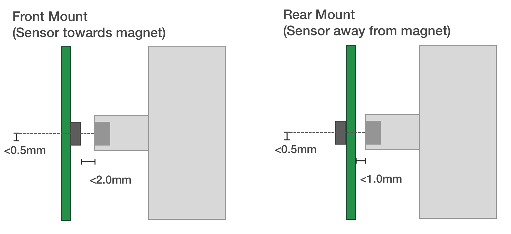
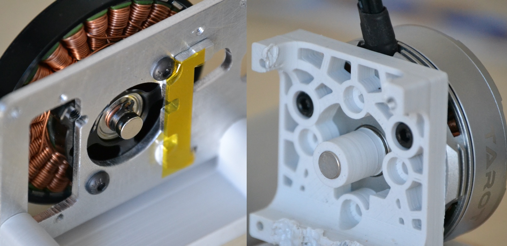
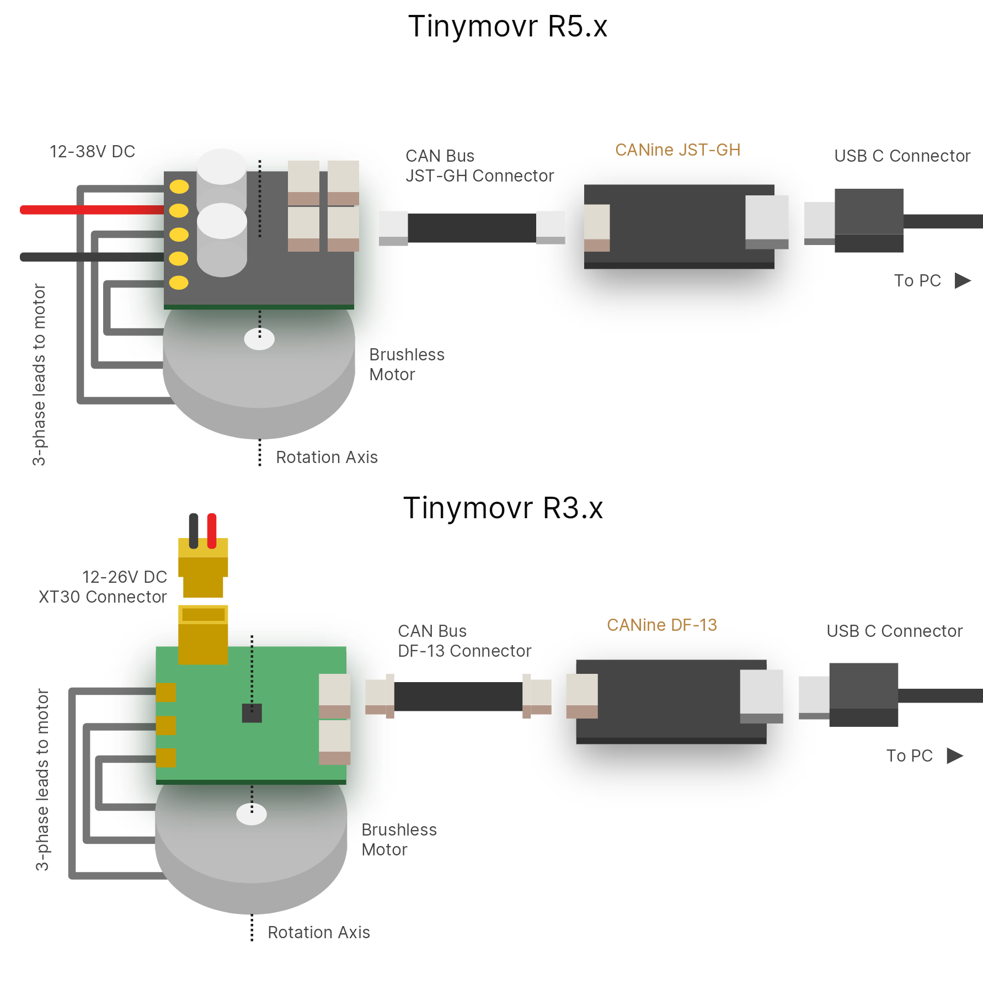
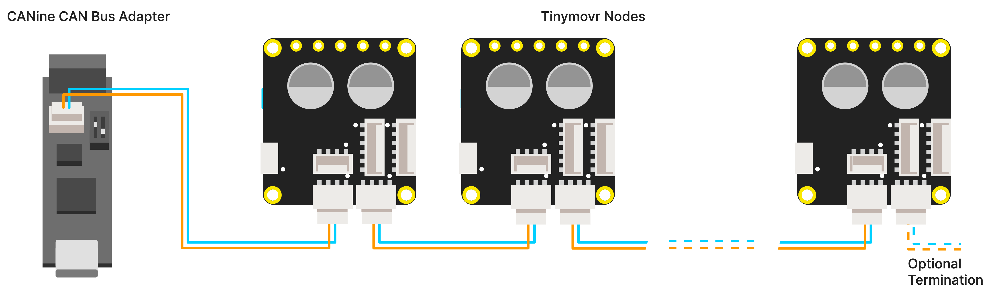

.. _hardware-setup:

**************
Hardware Setup
**************

Requirements
############

1. A 3-phase brushless motor (see below for supported types)
2. A diametrically magnetized sensor magnet (included with Tinymovr), mounted firmly on the motor shaft.
3. A means to talk CAN Bus, such as CANine or a Canable-compatible adapter.
4. A mechanical rig that ensures firm connection between the Tinymovr PCB and the brushless motor. Designs that can be 3D printed are available.

The Tinymovr Servo Kit includes all of the above, except for the CANine adapter, in a ready to use kit.

Supported Motor Types
#####################

Tinymovr R5.x and R3.x
**********************

Most three-phase pancake-style outrunners can be used with Tinymovr R5. While there is a lot of variation between motors of even the same size and external appearance, as a general rule-of-thumb motors ranging from 40mm outer diameter to 110mm should work fine with Tinymovr.

For a good quality and affordable option, take a look at our own `Tinymovr Motors <https://tinymovr.com/5208_motor>`_.

Tinymovr M5.x
*************

Most gimbal motors can be used with Tinymovr M5. Gimbal motors are essentially outrunners with high resistance (they have more turns). You can read more about gimbal motors in :ref:`gimbal-introduction`. Note that, to control gimbal motors with Tinymovr M5, you do not have to (in fact, should not) use Gimbal mode. Tinymovr M5 is capable of accurately sensing current at a lower scale, which is compatible with gimbal motors.

.. note::
   * Tinymovr expects a motor with sinusoidal back-EMF. Most brushless outrunners (including gimbal motors) have sinusoidal back-EMF. If uncertain and you have access to an oscilloscope, you can hook up the motor phases to the scope channels and check out the back-EMF for yourself. 

   * Motors with trapezoidal back-EMF can also be controlled, but control will be sub-optimal. The trapezoidal back-EMF will appear as residual in the dq frame, as a result it will be much harder for the current controller to regulate phase currents. The tangible result is that the motor may exhibit increased noise and vibration while running.

Mechanical Setup
################

Mounting Motor and Tinymovr
***************************

The most important aspect of a correct setup is to ensure the controller is properly positioned in relation to the sensor magnet. We assume that the center of the PCB, where the angle sensor IC is located, is located coaxially to the motor shaft, and thet the sensor magnet is at the end of the shaft (check out the diagrms below). In addition, the distance from the sensor magnet to the sensor IC should be less than 2mm (less than 1mm if you are mounting the PCB packwards, i.e. the sensor IC is facing away from the magnet).

  Tinymovr and motor mechanical mounting

A `3D printable sensor magnet jig <https://github.com/yconst/Tinymovr/blob/master/hardware/misc/magnet_jig.stl>`_ is available, suitable for 6mm disc magnets and 14, 19, 25 and 30mm motor hole diameters.

.. note::
   For safety reasons, you should always ensure the motor & controller assembly are secured to a stable surface before operation. The motor rotor may experience high acceleration that may cause damage or injury if not secured properly.

  Left: Magnet mount directly on shaft. Right: Magnet mount using 3d-printed holder.

Sensor Magnet and Mounting Tips
-------------------------------

* Unless using an external sensor (e.g. Hall effect sensor), Tinymovr requires proximity to the sensor magnet to operate. If the magnet is not in close proximity, an error will be raised upon power up, preventing any further action (calibration, closed loop control).

* Ensure the sensor magnet is firmly attached to the motor shaft, otherwise it may slip out of sync. Use strong adhesive to secure.

* It is possible to have the magnet on the rear side of the PCB, i.e. opposite of the magnet sensor IC, but the gap needs to be reduced to account for the PCB thickness. This has been verified by MPS in a forum post[1]_, quoted below: 
  *[...] this type of arrangement is possible, what really matters in the end is that there is enough magnetic field reaching the sensor.
  Of course the minimum distance is imposed by the thickness of the PCB, so it puts some constraints on the design, that you have to take into account when choosing the magnet (you can use our online simulation tool for that). But as long as the PCB is not acting as a magnetic shield (due to copper plane), then it is fine.*

* Calibration needs to be performed without any loads on the motor. If the motor is coupled to a load, the sensor offset angle may not be determined correctly, leading to a sub-optimal setup.

* For Tinymovr R3.3, adjust your termination resistor DIP switch (if needed) before putting together your actuator, to avoid needing to disassemble it for adjustment later on. See also :ref:`connecting-data`.

.. _electrical-setup:

Electrical Setup
################

Electrical setup comprises three main parts: Motor connection, data connection and power connection. Below is a diagram with the electrical connection scheme.

Connecting Motor
################

Connect the three motor phases to the three terminals on Tinymovr. The order of connection is not important, and motor direction will be determined during motor/sensor calibration.

* Tinymovr R3.x: The motor leads can be connected by soldering on the PCB. 

* Tinymovr R5.x: The leads can be connected by soldering on the PCB, or you can solder a screw terminal block and secure the motor leads on the block.

* Tinymovr M5.x: The leads can be connected by soldering on the PCB.

.. _connecting-data:

Connecting Data
###############

Connect the CAN bus header to one of the two CAN sockets on the board. It is not important which one you choose. If this is a terminal node in the CAN network, you may need to use a termination resistor, as follows:

* Tinymovr R3.x: flip ONLY the DIP switch labelled "CAN 120R" to on to enable the 120Ω termination resistor. 

* Tinymovr R5.x: you will need to provide an external 120Ω termination resistor.

* Tinymovr M5.x: you will need to provide an external 120Ω termination resistor.

In small setups with few nodes and short wires, it is better to enable just a single termination resistor, either on one Tinymovr board or on the CAN adapter. In setups with many nodes and long cables, you may need to enable termination resistors in both terminal nodes. A typical CAN driver has an “open-drain” output structure, meaning that the dominant edge is actively driven and the recessive edge is not. Therefore, properly terminating the bus is very important because it ensures that the recessive edge decays properly, and in time for the next bit's sample point [2]_.

.. warning::
   The UART pins in Tinymovr R5.1 have the silkscreen reversed. If you are planning to use UART with R5.1, consult :ref:`r51-erratum-1`. 

.. _connecting-power:

Connecting Power
################

* Tinymovr R3.x can be powered from a 12-26V (3S-6S) power source.

* Tinymovr R5.x can be powered from a 12-38V (3S-9S) power source.

* Tinymovr M5.x can be powered from a 12-38V (3S-9S) power source.

With the power source off/disconnected, connect the power leads observing correct polarity. Turn on/connect the power source. Upon successful power-up, the onboard LED should light up.

.. note::
   Each Tinymovr board has a capacitance of around 500μF (R3.x) / 240μF (R5) / 50μF (M5). Such capacitance can introduce significant inrush current upon power-on, especially if several boards are connected to the same power supply. To prevent damage to components from overcurrent, the use of an inrush current limiter or a current-limited power supply is advised. We offer a `Power Distribution and protection device <https://tinymovr.com/products/dianome>`_ which is suitable for this task.

.. _daisy-chain:

Connecting Multiple Nodes (Daisy-Chaining)
##########################################

Multiple nodes can be connected in a single CAN Bus network by means of daisy-chaining. Tinymovr R5 and Tinymovr M5 offer two CAN Bus ports for this purpose, which makes it easy to daisy-chain units. Note that for networks with long cable lengths, you may need termination on both ends. On one end this can be achieved with the onboard termination resistor of CANine, but on the other end you will have to provide your own.

.. [1] MPS forum post on mounting MA702 and magnet on opposite sides of PCB: https://forum.monolithicpower.com/t/mounting-ma702-and-magnet-on-opposite-sides-of-pcb/1609
.. [2] Split Termination, Texas Instruments. Available at `https://www.ti.com/document-viewer/lit/html/SSZTB40#:~:text=for%20each%20termination.-,Split%20Termination,typically%20between%201%2D100nF`.