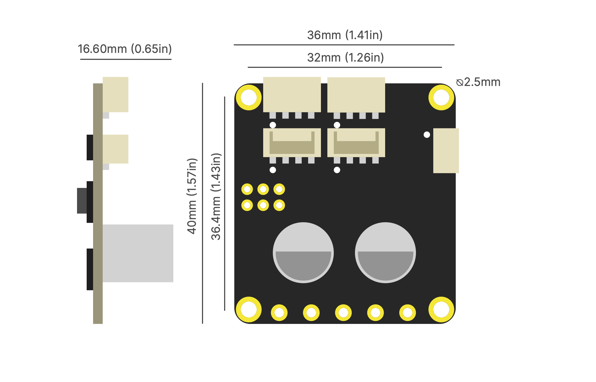
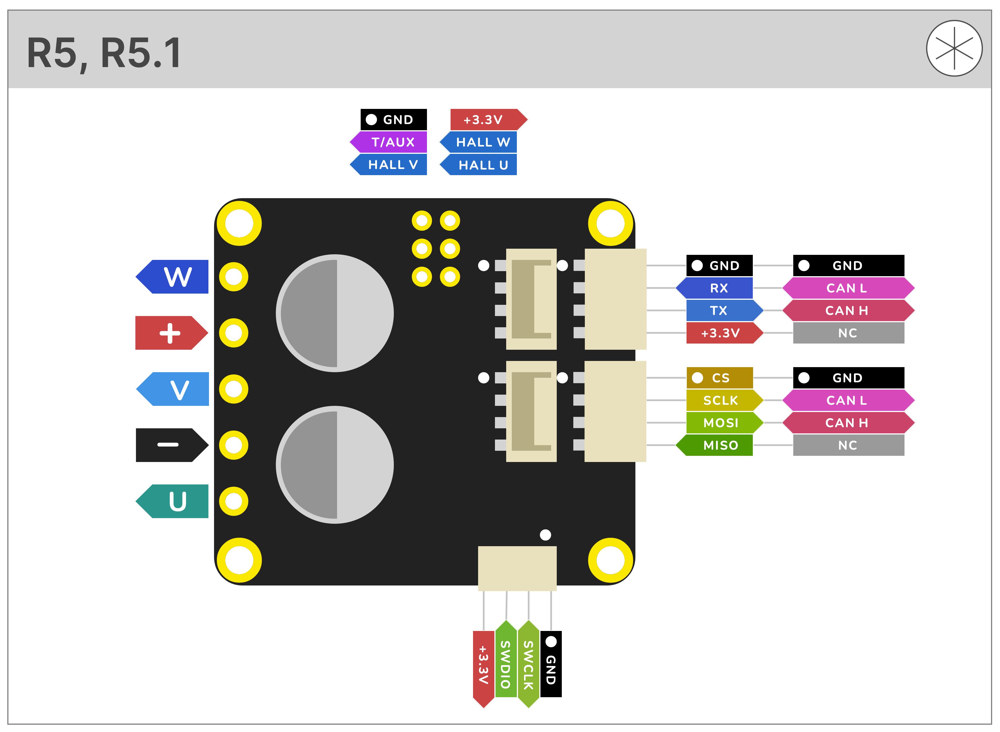
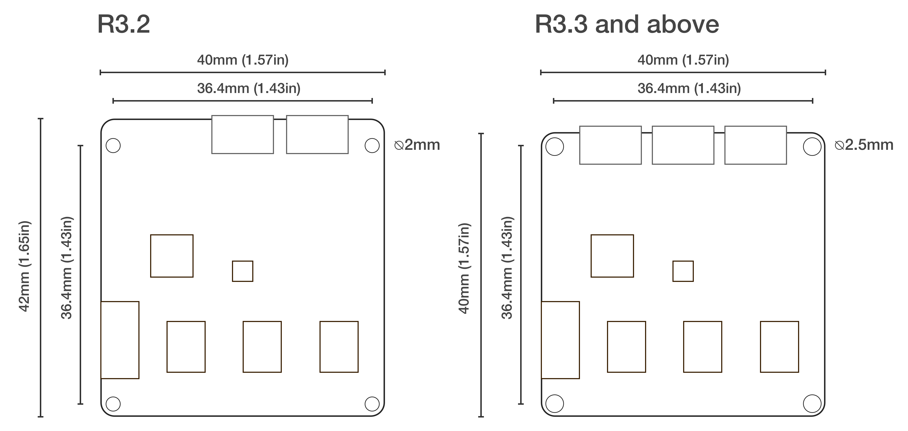
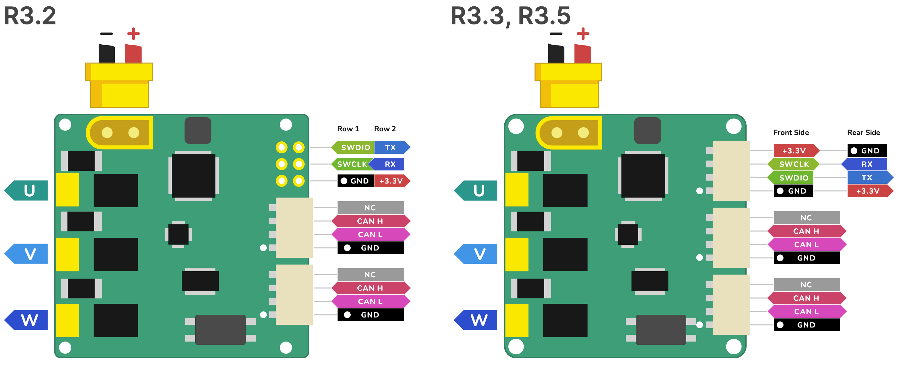

.. _hardware-overview:

*****************
Hardware Overview
*****************

R5.x
****

Tinymovr R5.x is the latest Tinymovr revision. It features increased connectivity in a reduced footprint.

Board Dimensions
################

Connectivity
############

.. warning::
   The UART pins in Tinymovr R5.1 have the silkscreen reversed. If you are planning to use UART with R5.1, consult :ref:`r51-erratum-1`. This only affects R5.1 boards.

R3.x
****************

R3.x is the previous Tinymovr revision, with CAN and UART connectivity.

Board Dimensions
################

Connectivity
############

