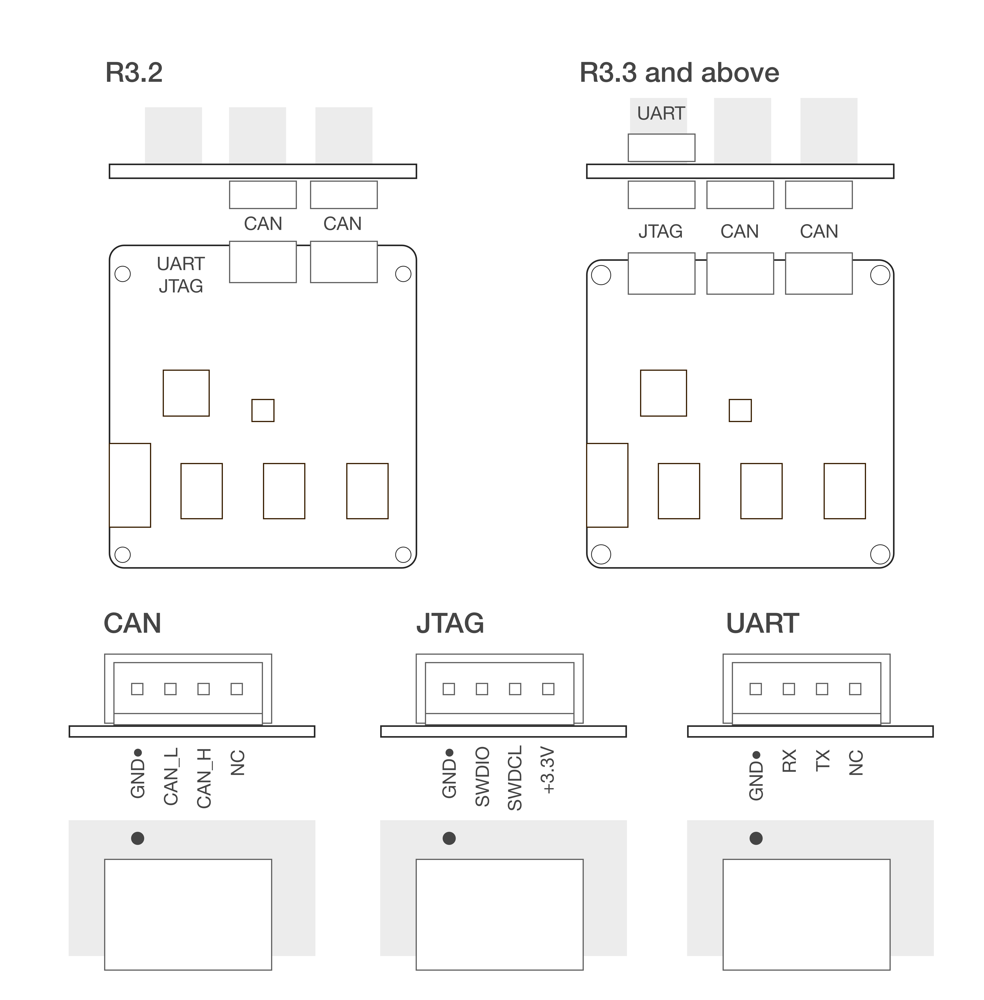

.. _hardware-overview:

*****************
Hardware Overview
*****************

R5.x
****

Tinymovr R5.x is the latest Tinymovr revision. It features increased connectivity in a reduced footprint.

Board Drawings
##############

.. image:: dimensions.png
  :width: 800
  :alt: Tinymovr dimensions

Connectivity
############

R3.3, R3.4, R3.5
****************

R3.3 is the previous Tinymovr revision, with CAN and UART connectivity.

Board Drawings
##############

.. image:: dimensions.png
  :width: 800
  :alt: Tinymovr dimensions

Connectivity
############

R3.2
****

R3.2 was the first Tinymovr revision to become publicly available, featuring CAN and UART connectivity.

Board Drawings
##############

.. image:: dimensions.png
  :width: 800
  :alt: Tinymovr dimensions

Connectivity
############

