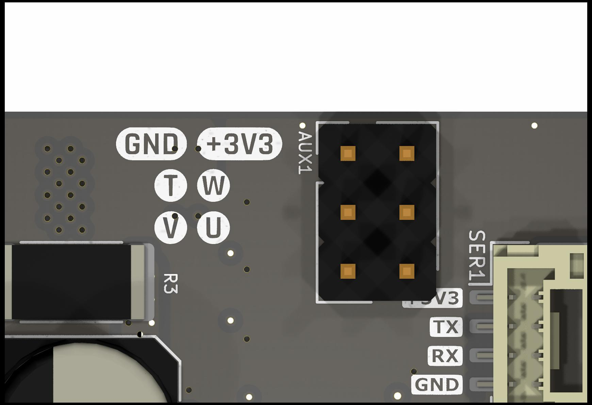

Sensors and Encoders
####################

Overview
********

This document provides information and guides for using the various angle sensor and encoder types supported by Tinymovr.

Hardware Setup
**************

Hall Effect Sensor
==================

To use Hall effect sensors, you need to connect the sensor's power supply, phases and ground to the correct pins on the Tinymovr board. The pinout for the Hall effect sensor connector is shown below.

.. note::
  The diagram shows the connector side of the board, i.e. the side where the CAN, UART and SPI connectors, and also the DC-link capacitors are located.

Note the U, V and W pins. These need to be connected to the respective pins of the sensor. The pin labeled T is currently not in use. In addition, the 3.3V power supply and the GND need to be connected to the sensor as well.

.. note::
  Tinymovr R5.2 and above supply 5V on the FLEX1 power supply pin. You can safely connect this to the Hall effect sensor + terminal.

  Tinymovr R5.1 supplies 3.3V on the AUX power supply pin. If your sensor uses 5V, or if it needs more than 50mA, you'll need to provide power externally, e.g. through a dedicated buck converter. 

Example
-------

The figure below shows an example of wiring a hub motor to Tinymovr, using the embedded Hall effect sensors of the motor for commutation. Note that the power and ground are connected to an external 5V power supply. Alternatively, if your Hall effect sensors are compatible with 3.3V input, you can connect the leads to the onboard connectors.

.. image:: hubmotor_diagram.png
  :width: 800
  :alt: Wiring diagram for connection of hub motor to Tinymovr

Units
*****

In Tinymovr, a 'tick' traditionally represents 1/8192 of a full mechanical rotation. The system utilizes floating-point values, thereby allowing resolution beyond the granularity of a single tick — down to the precision defined by the IEEE754 standard. This means that even when high-resolution sensors (with 16, 18, 20 or more bits) are employed, their precision is fully retained. Internally, sensor measurements are scaled to conform with the 8192-tick representation. In addition, using the Tinymovr client library, you can define commands in any angle unit you with, such as turns, rads, degrees etc. This gives you freedom in your application beyond the tick representation.

Reference Frames
****************

In the context of Tinymovr motor control, reference frames are essential for understanding the transformation of sensor data and user setpoints into motor control signals. The following diagram depicts the reference frames and their interconnections:

The diagram below illustrates the flow of data from the physical sensors through various observers and frames, finally reaching the motor.

.. image:: reference_frames.jpg
  :width: 800
  :alt: Diagram of the reference frames used in the firmware

Position Sensor Frame (PSF)
===========================

The Position Sensor Frame (PSF) corresponds to the filtered position sensor data. The main function of this frame is to provide feedback on the estimated position and velocity of the rotor, and therefore provide feedback to the position and velocity control loops. As the homing and trajectory planners also rely on position and velocity estimates, this frame also affects those functions.

Commutation Sensor Frame (CSF)
==============================

The Commutation Sensor Frame (CSF) corresponds to the filtered commutation sensor data. In ths simplest scenario, the position and commutation sensors are the same, as such the PSF and CSF are identical. The main function of this frame is to provide the estimated rotor angle to the current control loop, so that the electrical angle is derived in the Motor Frame, for Field Oriented Control.

Motor Frame (MF)
================

The origin of the Motor Frame (MF) corresponds to the zero electrical angle of the electrical cycle energized during calibration. This is the frame used by current control, and related dq, inverse Park and SVPWM transforms.

User Frame (UF)
===============

The User Frame is the interface exposed to the Tinymovr API, allowing the user to command the motor using position, veocity and current setpoints. This frame is related to the PSF, so that the user commands are predominantly based on the position data, with the commutation aspect being internally managed by the firmware's observer algorithms.

Frame Transforms
================

Data from the Position and Commutation Sensors is forwarded to their respective observers. The observers are responsible for filtering the sensor readings and providing position and velocity estimates. This processed data is then translated into two separate frames:

1. The Position Sensor Frame, which carries the filtered position data.
2. The Commutation Sensor Frame, which ensures the motor's proper electrical commutation.

These frames are then employed to inform the Motor Frame, which is the final reference before actuating the motor. 

As a summary, the following ransforms are derived during calibration and are stored in the Tinymovr firmware:

1. UF <-> PSF
2. PSF <-> CSF
3. CSF <-> MF
4. UF <-> MF

Tinymovr makes use of the XF1 library, which has been developed for this purpose and offers convenience functions to perform transforms, derive transforms from data, as well as inverse and constrained transforms.

Onboard Magnetic
****************

All Tinymovr controllers feature an onboard magnetic absolute angle sensor that allows high precision angle measurement for efficient commutation and highly dynamic motor control. This is enabled by default and does not require any specific setup, apart from initial reference frame calibration.

The onboard angle sensor is enabled by default, so no special configuration is necessary. Should you need to switch to the onboard sensor, use the following commands:

.. code-block:: python

    tmx.encoder.type = 0
    tmx.encoder.bandwidth = 300
    tmx.save_config()
    tmx.reset() # sensor type change is applied after reset

The value of 300Hz in bandwidth is the default value configured based on the charasteristics of the onboard angle sensor.

Sensor Configuration
********************

The sensor configuration cinsists of two steps. The first step concerns the setup of the individual sensors being used, and the second step concerns sensor selection. The corresponding sections in the device spec are `tmx.sensors.setup`, and `tmx.sensors.select`.

Sensor Setup
============

Onboard Magnetic Sensor
-----------------------

The Onboard Magnetic Sensor does not require any configuration. In this section the calibration state and any sensor errors can be seen.

External SPI Sensor
-------------------

The External SPI Sensor requires the correct sensor type to be set before enabling it. Three sensors are currently supported, the MPS MA7xx series, the AMS AS504x series, and the CUI AMT22 series. In addition, here you can see the calibration state and sensor errors.

Hall Effect Sensor
------------------

Hall effect sensors generate a specific sequence in the 3 phase Hall effect sensor signal as the rotor moves. By reading this sequence, the rotor position is determined in one of six 60 degree sectors along the electrical cycle. 

The Hall Effect Sensor does not require any configuration. In this section the calibration state and any sensor errors can be seen.

Sensor Selection
================

Sensor selection can be performed for positioning and for commutation. In both cases, the selection should be performed after hardware setup and any sensor setup has been fully completed, namely if using external sensors, the selection of the sensor type. The selection is among ONBOARD, EXTERNAL_SPI and HALL sensors. Once selection is complete, the Tinymovr needs to undergo calibration.

Examples
********

External AS5047 Sensor
======================

Ensure the hardware is properly connected. 

Then, configure the external sensor type as follows:

.. code-block:: python

    tmx.encoder.type = 1
    tmx.encoder.bandwidth = 100

Then select the `EXTERNAL_SPI` sensor for each of the position and commutation sensors:

.. code-block:: python

    tmx.encoder.type = 1
    tmx.encoder.bandwidth = 100

At this point, you are ready to perform motor/sensor calibration. This will measure the R and L values of the motor, derive frame transforms and eccentricity compensation tables.

.. code-block:: python

    tmx.controller.calibrate()

After calibration finishes, you should be able to control the motor:

.. code-block:: python

    tmx.controller.velocity_mode()
    tmx.controller.velocity.setpoint = 8192 # 60 rpm

The motor should now move at a constant velocity.

Once you have determined that the motor behaves as expected, set to idle and perform another config save to persist the configuration:

.. code-block:: python

    tmx.controller.idle()
    tmx.save_config()

Hall Effect Sensor
=============

Ensure the hardware is properly connected. 

Then select the `HALL` sensor for each of the position and commutation sensors, and configure the observer bandwidth as follows:

.. code-block:: python

    tmx.encoder.type = 1
    tmx.encoder.bandwidth = 100

This sets the type to Hall effect sensor, and the observer bandwidth to 100Hz.

Next, you need to set the motor pole pairs:

.. code-block:: python

    tmx.motor.pole_pairs = 15
    
Next comes tuning of gains. Gains are determined on the resolution of a full mechanical turn fo the motor. When using the onboard magnetic sensor, the resolution is fixed to 8192 ticks. However, when using the Hall effect sensor, the mechanical resolution is variable, and amounts to `6 * pole_pair_count`. As such, if you have a 15 pp motor, your mechanical resolution would be 90. 

Because of this vast change in resolution (almost 2 orders of magnitude), the gains need to be updated:

.. code-block:: python

    tmx.controller.position.p_gain = 5
    tmx.controller.velocity.p_gain = 0.07

The values above are just an example using a 15 pp hoverboard motor. For your own motor, you need to determine these experimentally. In position control mode, start by raising the default velocity gain until your motor experiences oscillations. The back up by a factor of two, and repeat the same for position control. This simple tuning heuristic does not result in an optimal configuration but the gains are workable.

At this point, you are ready to perform motor/sensor calibration. This will measure the R and L values of the motor, as well as the hall effect sensor sequence.

.. code-block:: python

    tmx.controller.calibrate()

After calibration finishes, you should be able to control the motor:

.. code-block:: python

    tmx.controller.velocity_mode()
    tmx.controller.velocity.setpoint = 100 # around 60 rpm for a 15 pp motor

The motor should now move at a constant velocity.

Once you have determined that the motor behaves as expected, set to idle and perform another config save to persist the configuration:

.. code-block:: python

    tmx.controller.idle()
    tmx.save_config()

Observer bandwidth
******************

Tinymovr uses a second order observer that filters readings from the sensors, and maintains a position and velocity state. The bandwidth value corresponds to the desired observer bandwidth. It is a configurable value and depends on the dynamics that you wish to achieve with your motor. Keep in mind that high bandwidth values used with motors with fewer pole pairs will make the motors oscillate around the setpoint and have a rough tracking performance (perceivable "knocks" when the rotor moves). On the other hand, too low of a bandwidth value may cause the motor to lose tracking in highly dynamic motions. If you are certain such motions will not be possible (e.g. in heavy moving platforms) you may reduce the bandwidth to ensure smoother motion.