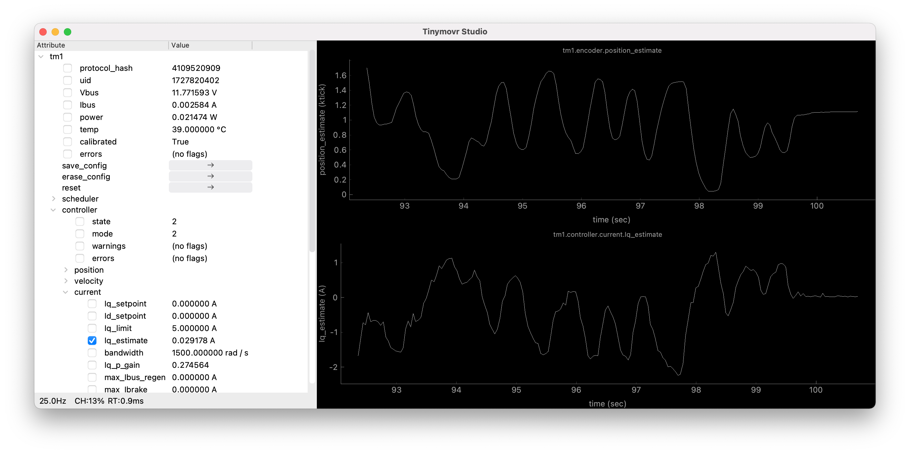
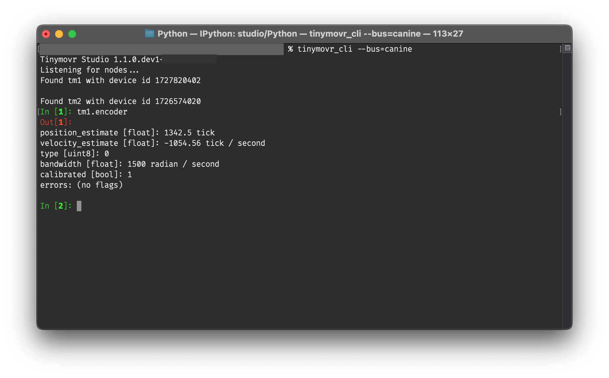
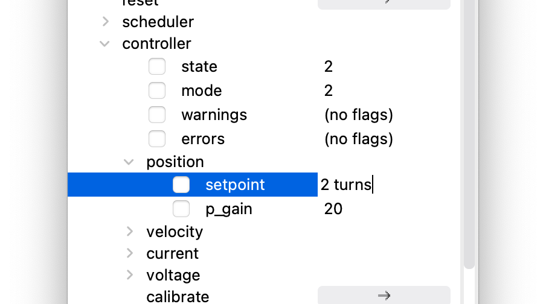

************
Studio Usage
************

.. |cli| raw:: html

   CLI

.. |gui| raw:: html

   GUI

Tinymovr Studio is a cross-platform GUI application, CLI application, and Python library that offers easy access to all of Tinymovr's functionality.

This documentation page includes examples both for the |gui| as well as the |cli| apps. 

Launching Studio
################

|gui|

.. code-block:: console

    tinymovr

|cli|

.. code-block:: console

    tinymovr_cli

Alternative Adapters/Firmwares
##############################

By default Tinymovr Studio searches for either slcan-compatible CAN bus adapters or adapters using the `CANine firmware <https://github.com/tinymovr/CANine>`_ [1]_. To specify an alternative device, use the `--bus` command line argument. 

For instance, to work with SocketCAN-compatible adapters in linux, launch Tinymovr Studio as follows:

|gui|

.. code-block:: console

    tinymovr --bus=socketcan

|cli|

.. code-block:: console

    tinymovr_cli --bus=socketcan

.. [1] Note that you need to have completed `setting up CANine <https://canine.readthedocs.io/en/latest/canine.html#canine-firmware>`_ before working with CANine.

Compatibility
#############

Tinymovr Studio includes by default a checksum comparison to determine protocol compatibility between firmware and studio version. This is performed each time a node is discovered, and prior to initializing the tinymovr object. If you see a compatibility-related message, please upgrade to the latest studio and firmware versions. 

Custom Device Specs
###################

You can specify a custom device spec (YAML file) as a command line argument:

|gui|

.. code-block:: console

    tinymovr --spec=/path/to/myspec.yaml

|cli|

.. code-block:: console

    tinymovr_cli --spec=/path/to/myspec.yaml

This is useful, for instance, if you have altered the default Tinymovr spec files. Using this parameter with a project developed using `Avlos <https://github.com/tinymovr/avlos>`_, you can even use Tinymovr Studio to control your own custom devices!

Issuing Commands in CLI
#######################

|cli|

You can read/write variables and issue commands using the respective Tinymovr handle, e.g.:

.. code-block:: python

    tm1.encoder

or

.. code-block:: python

    tm1.controller.pos_setpoint = 10000

Replace "tm1" with the correct device ID if necessary. Full tab completion is available.

Multiple Instances
##################

In order for multiple Tinymovr instances to coexist in the same CAN network, they need to have unique IDs. The default ID is 1. To assign different IDs to each board, follow the method below:

1. Connect a single Tinymovr to the bus and launch Studio. The board will be assigned the default ID, 1, and will be accessible as tm1.

2. |gui| Change the ID

The board will be discovered with the new ID. Studio GUI will rescan, discover the new node, and remove the old instance.

2. |cli| Change the ID

.. code-block:: python

    tm1.comms.can.id = x

where x is the desired ID. You can assign IDs in the range 1-1024.

The board will be discovered with the new ID. Relaunch Studio CLI to remove the old board instance. 

3. |gui| Save configuration.

3. |cli| Save configuration.

.. code-block:: python

    tm1.save_config()

4. Power down or reset the board. Tinymovr is now ready to use with the new ID.

.. _command-line-options:

Command-line options
####################

Tinymovr Studio supports the following command line options.

``--bus=<bus>``
=======================

The --bus option specifies a CAN bus type to use.

Example:

|gui|

.. code-block:: console

    tinymovr --bus=canine

|cli|

.. code-block:: console

    tinymovr_cli --bus=canine

All interfaces offered by python-can are supported.

``--chan=<chan>``
=================

The --chan options specifies a channel to use, optionally together with the --bus option. 

Example:

|gui|

.. code-block:: console

    tinymovr --bus=socketcan --chan=CAN0

|cli|

.. code-block:: console

    tinymovr_cli --bus=socketcan --chan=CAN0

By default, Tinymovr Studio will use slcan as the interface, and will search for CANAble/CANtact-type devices with slcan firmware. Such is the CANine adapter supplied with Tinymovr Servo Kits.

``--bitrate=<chan>``
====================

Specifies a bitrate in baud.

Example:

|gui|

.. code-block:: console

    tinymovr --bus=socketcan --bitrate=1000000

|cli|

.. code-block:: console

    tinymovr_cli --bus=socketcan --bitrate=1000000

By default, Tinymovr Studio will use 1000000 as bitrate.
We tested with 1000000, 500000 and 250000 baud.

Units
#####

Tinymovr Studio introduced physical units and quantities since v0.3.0. Units are introduced through the `Pint <https://pypi.org/project/Pint/>`_ package. Using units you will see all values that you query associated with a unit, which forms a physical quantity.

|gui|

In the GUI, units are displayed by default in any quantity that supports them. For instance:

You can set any quantity supporting units by specifying the desired compatible unit next to the quantity you want to set. For instance, to set the position setpoint:

|cli|

In the CLI, units are displayed whenever a quantity that supports them is printed:

.. code-block:: python

    In [1]: tm1.encoder.pos_estimate
    Out[1]: 0.0 <Unit('tick')>

You can also set quantities in any (defined) unit you wish. For instance:

.. code-block:: python

    In [1]: tm1.controller.pos_setpoint = 2.0 * rad

The above will set the rotor position to 2 radians from the initial position. Similarly for velocity:

.. code-block:: python

    In [1]: tm1.controller.vel_setpoint = 3.0 * rad / second

Will set velocity to 3 radians/second. If not unit is used in setting a value, the default units will be assumed, in the above cases ticks and ticks/second.

The ureg object is the unit registry, and it is that which holds all unit definitions. You can use it to do all sorts of cool stuff such as doing conversions, defining your own shortcuts or even new units.

For instance, to define a few frequently used shortcuts in a program:

.. code-block:: python

    from avlos import get_registry
    ureg = get_registry()
    mA = ureg.milliampere
    rad = ureg.radian
    s = ureg.second

Then you can use the defined shortcuts to intuitively set values, such as a position setpoint with velocity and current feed-forwards:

.. code-block:: python

    tm1.controller.pos_setpoint = 2*PI * rad
    tm1.controller.vel_setpoint = PI * rad/second
    tm1.controller.cur_setpoint = 1.5 * ampere

Take a look at the :ref:`api-reference` for default units used in each command.

For more information on units and their usage, take a look at `Pint's documentation <https://pint.readthedocs.io/en/stable/>`_

Socketcan & Linux
#################

You can use a socketcan-enabled CAN adapter with Tinymovr Studio. The CANine adapter supplied with Tinymovr Servo Kits supports Socketcan natively with the alternative Candlelight Firmware. To connect to a Socketcan device, run Studio as follows:

|gui|

.. code-block:: console

    tinymovr --bus=socketcan --chan=CAN0

|cli|

.. code-block:: console

    tinymovr_cli --bus=socketcan --chan=CAN0

