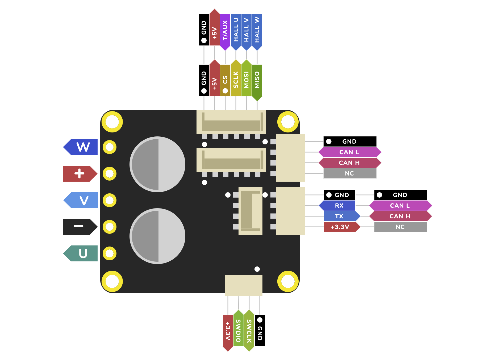
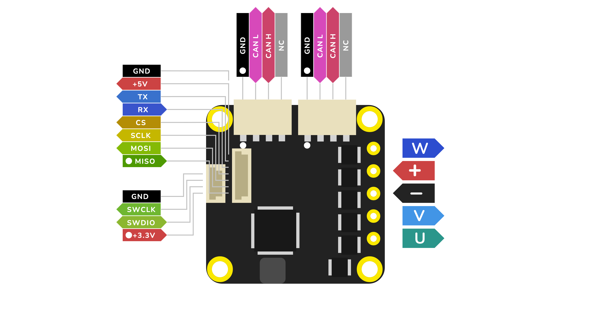
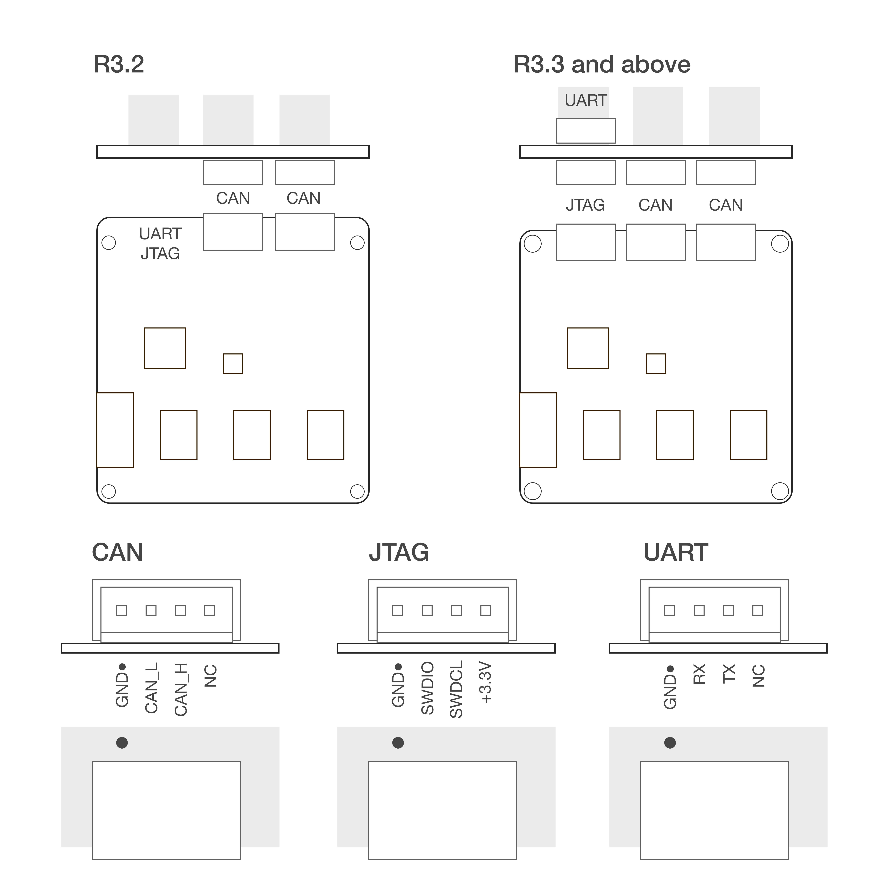

Upgrading Firmware
******************

Introduction
############

It is possible to upgrade the firmware of your Tinymovr device in different ways, depending on the board you have: 

1. :ref:`upgrade-using-dfu` connection (fw 1.6 or later, boards shipped starting 8th Sep. 2023)
2. :ref:`upgrade-using-activeflashlight` connection (fw 1.5 or earlier, boards shipped until the 7th Sep. 2023)
3. :ref:`upgrade-using-vscode-and-jlink` (all boards)

A revision of the hardware connectivity and each of the above methods is provided below.

Connectivity
############

R5.2
====

R5.0, R5.1
==========

.. image:: connectors_r5.png
  :width: 800
  :alt: Tinymovr R5.0 and R5.1 connectors and pinouts

M5.1
====

R3.x
====

.. _upgrade-using-dfu:

Upgrade using DFU and CAN bus
#############################

Since firmware 1.6, we have streamlined the firmware update process with a bootloader that supports DFU through the native CAN bus interface. This guide will walk you through the steps to upgrade your Tinymovr's firmware.

Prerequisites
=============

1. **Install the Tinymovr Package**:

   If you haven’t already, install the Tinymovr package. This package also comes with the required dependencies:

   .. code-block:: bash

      pip install tinymovr

2. **Download the Firmware**:

   Head to the `Tinymovr Releases Page <https://github.com/tinymovr/Tinymovr/releases/latest>`_ and download the precompiled binary of the firmware that matches your board's hardware revision. Firmware binaries follow the format: ``tinymovr<firmware_version>-<hardware_revision>.bin``. For instance, you might come across a file named ``tinymovr1.5.0-M5.1.bin``.

Flashing the Firmware
=====================

1. **Set Up Your CAN Interface**:

   Ensure your CAN interface is connected and configured correctly with Tinymovr.

2. **Enter DFU Mode**:

   Launch the Tinymovr CLI:

   .. code-block:: bash

      tinymovr_cli

   Once inside teh CLI, type the following to enter DFU Mode:

   .. code-block:: python

      tmx.enter_dfu()

   Then exit the CLI by typing ``exit``.

   If you are getting an exception after this command, it means that either your Tinymovr does not come with the DFU bootloader, so you will have to :ref:`upgrade-using-activeflashlight`, or your board is already in DFU mode.

2. **Run the Script**:

   With the firmware .bin file you downloaded, execute the DFU script:

   .. code-block:: bash

      tinymovr_dfu --node_id=<your node id> --bin=path/to/your/downloaded/tinymovr<version>-<revision>.bin

   Replace the placeholders in the path with the appropriate values based on where you've saved the .bin file and its name.

   Example:

   .. code-block:: bash

      tinymovr_dfu --node_id=<your node id> --bin=~/Downloads/tinymovr1.5.0-M5.1.bin

   To forgo the automatic reset post-flash, append the ``--no-reset`` flag:

   .. code-block:: bash

      tinymovr_dfu --node_id=<your node id> --bin=~/Downloads/tinymovr1.5.0-M5.1.bin --no-reset

3. **Follow the Script's Prompts**:

   The script initially checks if the device's current firmware matches the .bin file. If they're identical, it will bypass the flashing process. If not, it will erase the prior firmware, flash the new version, and validate the update.

4. **Concluding Steps**:

   If you skipped using the ``--no-reset`` flag, the device will reboot automatically after the update. If you used the flag, you'd need to power off and on the Tinymovr by hand.

   You're all set! Your Tinymovr is updated and primed for use with the fresh firmware.

.. note::

   Before updating, it's a wise move to backup your current firmware and settings. Always pore over any version-specific instructions or release notes accompanying fresh firmware updates to stay informed.

Recovery Mode
#############

The DFU mode can be triggered upon device power up, which is useful to deal with problems resulting from inaccessible user firmware (e.g. mismatch between firmware and hardware revision). This feature will put the device into DFU mode immediately after power up. To use recovery mode, run the following command:

   .. code-block:: bash

      tinymovr_dfu --node_id=<your node id> --recovery

Then follow the instructions to trigger DFU mode. After this step, you will be able to :ref:`upgrade-using-dfu`. You will need to know the device node ID to use this feature.

.. _upgrade-using-activeflashlight:

Upgrade using ActiveFlashlight and UART
#######################################

Prerequisites
=============

For this method you will need a USB to UART adapter or similar device to connect to Tinymovr's UART interface, such as an FTDI interface or similar. Such devices are very common and inexpensive. Please follow the diagram below to correctly setup the UART interface.

.. warning::
   The UART port on Tinymovr is NOT 5V tolerant. Applying 5V voltage will immediately damage the onboard PAC5527 controller. Please use only 3.3V for UART communication.

.. warning::
   The UART port on Tinymovr offers a 3.3v output for driving very light loads (30mA absolute max). Tinymovr cannot be powered by this pin. In addition, most UART adapters offer 5V power, which is incompatible with Tinymovr. **In short: If in doubt, leave this pin disconnected**.

Flashing the Firmware
=====================

.. warning::
   This is a legacy upgrade approach that is maintained here to facilitate existing users. New users should :ref:`upgrade-using-dfu`

Qorvo, the maker of the PAC chip used in Tinymovr, provides an application to interface with the bootloader environment using UART and enable firmware upgrades. It is available through the `Qorvo website <https://www.qorvo.com/products/p/PAC5527#evaluation-tools>`_ as an archive named "PAC55xx ActiveFlashLight Bootloader". Please download and extract the archive and follow these steps:

1. Inside the "resources" folder run the ActiveFlashLight application
2. Power on Tinymovr
3. Under 'COMMUNICATION' click on 'Connect'
4. Power off and on Tinymov. The application status should now indicate that it is connected to the device. 
5. Under 'PROGRAMMING' click on 'Browse...' and find the latest 'tinymovr<firmware_version>-R<board_revision>.bin' file for the board being used, which can be downloaded from `releases <https://github.com/tinymovr/Tinymovr/releases>`_. Also take note of any version specific instructions in the release notes.
6. Under 'PROGRAMMING' click on 'Auto Program'. The application will erase, flash and verify the device with the new firmware. Wait for the process to complete
7. Once complete, power off Tinymovr and quit the application

You should now be able to use Tinymovr as usual with the new firmware.

.. _upgrade-using-vscode-and-jlink:

Upgrade using VSCode and J-Link
###############################

Please see :ref:`develop-setting-up-vscode`.

.. warning::
   Depending on the hardware revision and the batch, either a vertical or a sideways JST-SH connector is used for SWD. In any case, the pin order shown in the above figures is correct. Please consider this when connecting your SWD adapter.

